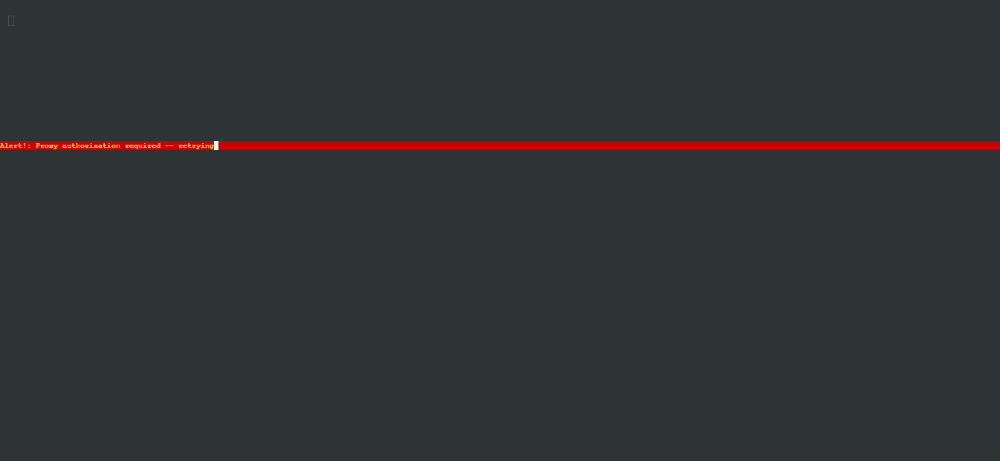
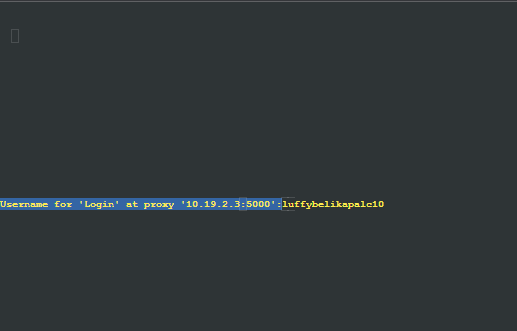
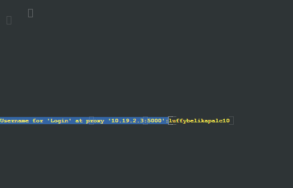
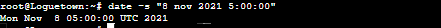
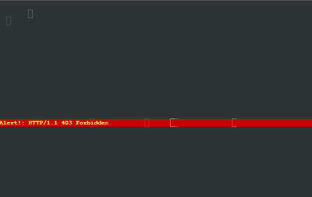
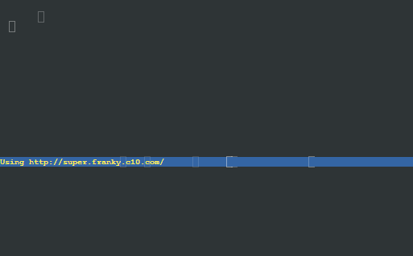
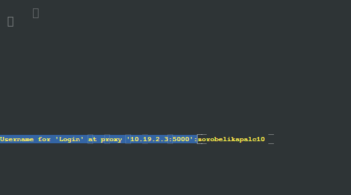
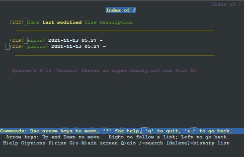

# Jarkom-Modul-3-C10-2021

## Anggota Kelompok C10
| Nama | NRP |
| ------------- | ------------- |
| Christian Bennett Robin | 05111940000078  |
| Erza Janitradevi Nadine  | 05111940000153  |
| Akmal Zaki Asmara  | 05111940000154  |

## Soal dan Pembahasan
### No 1
Soal : Luffy bersama Zoro berencana membuat peta tersebut dengan kriteria EniesLobby sebagai DNS Server, Jipangu sebagai DHCP Server, Water7 sebagai Proxy Server.

Jawaban : Membuat topologi seperti perintah soal dan mencoba ping google.com pada EniesLobby,  Jipangu, dan Water7.
- Topologi
  
- ping google.com<br/>
  
  
  
  
### No 2
Soal: dan Foosha sebagai DHCP Relay

Jawaban : Untuk menjadikan Foosha sebagai DHCP Relay, perlu dilakukan konfigurasi pada Jipangu sebagai DHCP Server dan pada Foosha. 
- Menambahkan konfigurasi pada `isc-dhcp-server` pada Jipangu
  Mengarahkan interfaces pada `eth0` karena Jipangu tersambung dengan nodes lainnya melalui eth0 sehingga Jipangu dapat tersambung dengan Foosha.
  

- Menambahkan konfigurasi pada `dhcpf.conf` pada Jipangu
  <br/>Pada Jipangu dilakukan konfigurasi untuk melakukan relay pada subnet yang menghubungkan Jipangu dengan Foosha, yaitu subnet 10.19.2.0.
  ```
    subnet 10.19.2.0 netmask 255.255.255.0{
     }
  ```
  
- Menambahkan konfigurasi pada `isc-dhcp-relay` pada Foosha
  <br/>Menambahkan IP Address Jipangu pada `SERVERS` sehingga Foosha dapat menerima dan melanjutkan request kepada DHCP Server. Kemudian, pada `INTERFACES` ditambahkan `eth0 eth1 eth2` supaya Foosha dapat berjalan dan menerima request dari switch 1, 2, dan 3.
   
   
### Konfigurasi 'dhcpd.conf' pada Jipangu
Konfigurasi pada `/etc/dhcp/dhcpd.conf` dibawah ini akan digunakan untuk nomor 3-6


### No 3
Soal: Semua client yang ada HARUS menggunakan konfigurasi IP dari DHCP Server. Client yang melalui Switch1 mendapatkan range IP dari [prefix IP].1.20 - [prefix IP].1.99 dan [prefix IP].1.150 - [prefix IP].1.169

Jawaban : 
- Supaya semua client mendapatkan IP dari DHCP Server, pada konfigurasi `/etc/network/interfaces` ditambahkan 
  ```
    auto eth0
    iface eth0 inet dhcp
  ```
  dan comment `echo nameserver 192.169.122.1 > /etc/resolv.conf` pada masing-masing client sehingga nameserver mengarah pada DHCP Server.
  
- Konfigurasi pada `/etc/dhcp/dhcpd.conf` untuk set range IP pada switch 1 
  <br/>Konfigurasi untuk switch 1 menggunakan subnet `10.19.1.0 ` seperti pada gambar di atas dengan range ip sebagai berikut. Angka 1 pada IP menunjukkan bahwa IP ini digunakan untuk switch 1 yang terhubung dengan `eth1`.
  ```
  subnet 10.19.1.0 netmask 255.255.255.0{
    ...
    range 10.19.1.20 10.19.1.99;
    range 10.19.1.150 10.19.1.169;
    ...
   }
  ```
- Berikut ini adalah Client Loguetown dan Alabasta yang memiliki IP dari DHCP Server
  
  
  
### No 4
Soal: Client yang melalui Switch3 mendapatkan range IP dari [prefix IP].3.30 - [prefix IP].3.50 

Jawaban : 
- Konfigurasi pada `/etc/dhcp/dhcpd.conf` untuk set range IP pada switch 3 
  <br/>Konfigurasi untuk switch 3 menggunakan subnet `10.19.3.0 ` seperti pada gambar di atas dengan range ip sebagai berikut. Angka 3 pada IP menunjukkan bahwa IP ini digunakan untuk switch 3 yang terhubung dengan `eth3`.
  ```
  subnet 10.19.3.0 netmask 255.255.255.0{
    range 10.19.3.30 10.19.3.50;
    ...
   }
  ```

- Berikut ini adalah Client Skypie dan Tottoland yang memiliki IP dari DHCP Server. Skypie memiliki ip `10.19.3.69` karena diberikan fixed address yang konfigurasinya akan dijelaskan pada nomor 7.
  
  
  
### No 5
Soal: Client mendapatkan DNS dari EniesLobby dan client dapat terhubung dengan internet melalui DNS tersebut.

Jawaban:
- Menggunakan DNS Forwarder pada EniesLobby sebagai DNS Server supaya client dapat terhubung ke internet dengan menambahkan konfigurasi sebagai berikut pada `/etc/bind/named.conf.options`
  ```
  ...
  forwarders {
    192.168.122.1;
  };
  ...
  ```
  dan comment `dnssec-validation auto;` serta menambahkan`allow-query{any;};`
- Pada semua client akan terlihat bahwa nameserver mengarah pada IP Enieslobby yaitu `10.19.2.2` ketika mengecek `/etc/resolv.conf` seperti pada gambar berikut <br/>
  


### No 6
Soal: Lama waktu DHCP server meminjamkan alamat IP kepada Client yang melalui Switch1 selama 6 menit sedangkan pada client yang melalui Switch3 selama 12 menit. Dengan waktu maksimal yang dialokasikan untuk peminjaman alamat IP selama 120 menit.

Jawaban:
- Menambahkan konfigurasi `dhdcp.conf` untuk switch 1 dan switch 3 sebagai berikut. 
  ```
    subnet 10.19.1.0 netmask 255.255.255.0{
      ...
      default-lease-time 360;
      max-lease-time 7200;
      ...
     }
  ```
   ```
    subnet 10.19.3.0 netmask 255.255.255.0{
      ...
      default-lease-time 720;
      max-lease-time 7200;
      ...
    }
  ```
  Default lease time untuk switch 1 adalah 360 detik dan switch 3 adalah 720 detik, sedangkan max lease time switch 1 dan 3 bernilai sama yaitu 7200.
  
### No 7
Soal:
Luffy dan Zoro berencana menjadikan Skypie sebagai server untuk jual beli kapal yang dimilikinya dengan alamat IP yang tetap dengan IP [prefix IP].3.69 (7). 

Jawab:
Edit konfigurasi /etc/dhcp/dhcpd.conf di Jipangu, lalu tambahkan baris berikut:

```
...
host Skypie {
    hardware ethernet 3e:a0:f8:fb:39:c5;
    fixed-address 10.19.3.69;
}
```

Setelah itu edit konfigurasi /etc/network/interfaces di Client, seperti misalnya di Loguetown dan tambahkan baris berikut:

```
...
hwaddress ether 3e:a0:f8:fb:39:c5
```

Saat menyalakan node Skypie, didapatkan IPnya tetap, yaitu 10.19.3.69


### No 8  
Soal :  
Pada Loguetown, proxy harus bisa diakses dengan nama jualbelikapal.yyy.com dengan port yang digunakan adalah 5000

Jawab :   
Untuk membuat proxy, install squid di Water 7 menggunakan `apt-get install squid`, setelah itu buat konfigurasi squid di `/etc/squid/squid.conf`.

Buat konfigurasi proxy untuk menggunakan port 5000 dan memiliki nama jualbelikapal.c10.com

```
http_port 5000
visible_hostname jualbelikapal.c10.com
```

### No 9
Soal :   
Agar transaksi jual beli lebih aman dan pengguna website ada dua orang, proxy dipasang autentikasi user proxy dengan enkripsi MD5 dengan dua username, yaitu luffybelikapalyyy dengan password luffy_yyy dan zorobelikapalyyy dengan password zoro_yyy 

Jawab :    
Untuk membatasi akses ke proxy, dapat dengan menggunakan htpasswd yang pernah dipelajari di modul sebelumnya.

Buat konfigurasi htpasswd dengan user luffybelikapalc10 dengan password luffy_c10, dan user zorobelikapalc10 dengan password zoro_c10

```
htpasswd -c /etc/squid/passwd luffybelikapalc10
htpasswd /etc/squid/passwd zorobelikapalc10
```

Masukkan konfigurasi password kedalam squid

```
...
auth_param basic program /usr/lib/squid/basic_ncsa_auth /etc/squid/passwd
auth_param basic children 5
auth_param basic realm Login
auth_param basic credentialsttl 2 hours
auth_param basic casesensitive on

acl USERS proxy_auth REQUIRED
http_access allow USERS
http_access deny all
```

Squid akan mengambil konfigurasi password dari `/etc/squid/passwd` dan mengaturnya untuk semua request yang masuk harus melakukan authentikasi terlebih dahulu.

Lakukan restart pada squid dengan menggunakan `service squid restart`

Setelah itu, tes di LogueTown menggunakan lynx. Namun, sebelum itu kita perlu melakukan setting agar LogueTown menggunakan proxy dengan `export http_proxy="http://10.19.2.3=5000"`. Setelah itu barulah lakukan lynx ke situs manapun.




### No 10
Soal :   
Transaksi jual beli tidak dilakukan setiap hari, oleh karena itu akses internet dibatasi hanya dapat diakses setiap hari Senin-Kamis pukul 07.00-11.00 dan setiap hari Selasa-Jum’at pukul 17.00-03.00 keesokan harinya (sampai Sabtu pukul 03.00)

Jawab :  
Untuk membatasi waktu proxy, maka buat konfigurasi waktu di `/etc/squid/acl.conf` dan isi dengan waktu yang akan dibatasi

```
acl TIME time MTWH 07:00-11:00
acl TIME time TWHF 17:00-23:59
acl TIME time WHFA 00:00-03:00
```

Masukkan konfigurasi acl di `/etc/squid/acl.conf` ke dalam `/etc/squid/squid.conf` dan tambahkan acl time pada http_access.

```
include /etc/squid/acl.conf
...

http_access allow TIME USERS
...
```

Lakukan restart pada squid dan tes proxy di LogueTown. Tes pada hari senin jam 10 pagi :




Tes pada hari senin jam 5 pagi :



### No 11
Soal :    
Agar transaksi bisa lebih fokus berjalan, maka dilakukan redirect website agar mudah mengingat website transaksi jual beli kapal. Setiap mengakses google.com, akan diredirect menuju super.franky.yyy.com dengan website yang sama pada soal shift modul 2. Web server super.franky.yyy.com berada pada node Skypie

Jawab :   
Buat domain baru bernama super.franky.c10.com di EniesLobby. Tambahkan konfigurasi domain super.franky.c10.com di `/etc/bind/named.conf.local`

```
zone "super.franky.c10.com"{
        type master;
        file "/etc/bind/super.franky.c10.com";
        allow-transfer {10.19.3.69;};
};
```

Buat konfigurasi untuk domain super.franky.c10.com di `/etc/bind/super.franky.c10.com`

```
$TTL    604800
@       IN      SOA     super.franky.c10.com. root.super.franky.c10.com. (
                         2021110801             ; Serial
                         604800         ; Refresh
                          86400         ; Retry
                        2419200         ; Expire
                         604800 )       ; Negative Cache TTL
;
@       IN      NS      super.franky.c10.com.
@       IN      A       10.19.3.69 ; IP Skypie
www     IN      CNAME   super.franky.c10.com.
@       IN      AAAA    ::1
```

Lakukan restart pada bind menggunakan `service bind9 restart`. Setelah itu buat webserver super.franky.c10.com di Skypie. Buat konfigurasi webserver di `/etc/apache2/sites-available/super.franky.c10.com.conf`

```
<VirtualHost *:80>

        ServerAdmin webmaster@localhost
        ServerAlias www.super.franky.c10.com
        DocumentRoot /var/www/super.franky.c10.com

        ErrorLog ${APACHE_LOG_DIR}/error.log
        CustomLog ${APACHE_LOG_DIR}/access.log combined

</VirtualHost>
```

Download isi super.franky.c10.com dengan menggunakan `wget https://raw.githubusercontent.com/FeinardSlim/Praktikum-Modul-2-Jarkom/main/super.franky.zip` dan unzip file tersebut. Setelah itu rename folder menjadi super.franky.c10.com

Aktifkan situs dengan menggunakan `a2ensite apache2 super.franky.c10.com` dan lakukan restart pada apache dengan `service apache2 restart`

Lalu tambahkan konfigurasi pada squid sehingga ketika mengakses situs google.com, maka akan langsung diredirect ke super.franky.c10.com

```
acl BLACKLIST dstdomain .google.com
deny_info http://super.franky.c10.com/ BLACKLIST
http_access deny TIME BLACKLIST
```

Ubah nameserver pada Water7 menjadi 10.19.2.2 dan lakukan restart squid menggunakan `service squid restart`

Tes menggunakan lynx di LogueTown.





### No 12 & 13
Soal:   
Saatnya berlayar! Luffy dan Zoro akhirnya memutuskan untuk berlayar untuk mencari harta karun di super.franky.yyy.com. Tugas pencarian dibagi menjadi dua misi, Luffy bertugas untuk mendapatkan gambar (.png, .jpg), sedangkan Zoro mendapatkan sisanya. Karena Luffy orangnya sangat teliti untuk mencari harta karun, ketika ia berhasil mendapatkan gambar, ia mendapatkan gambar dan melihatnya dengan kecepatan 10 kbps (12). Sedangkan, Zoro yang sangat bersemangat untuk mencari harta karun, sehingga kecepatan kapal Zoro tidak dibatasi ketika sudah mendapatkan harta yang diinginkannya (13).

Jawaban:
Edit konfigurasi /etc/squid/squid.conf di Water7 dan tambahkan baris berikut: 

```
...
acl USERS proxy_auth REQUIRED
acl USER1 proxy_auth luffybelikapalc10
acl USER2 proxy_auth zorobelikapalc10
acl BLACKLIST dstdomain .google.com
acl ext_block url_regex "/etc/squid/ext_block.txt"

delay_pools 2
delay_class 1 1
delay_access 1 allow USER2
delay_parameters 1 -1/-1
delay_class 2 1
delay_access 2 allow ext_block
delay_parameters 2 1250/1250
...

```

Pool dibagi menjadi 2 class untuk 2 konfigurasi. Class pertama dikonfigurasi untuk USER2 yaitu zorobelikapalc10. Agar bandwidthnya tidak dilimit seperti permintaan soal 13, maka delay_parameter pool 1 diatur agar menjadi -1/-1. Sedangkan class kedua dikonfigurasi agar bandwidthnya dilimit menjadi 10 kbps atau 1250 Bps seperti permintaan soal 12. Class kedua juga dikonfigurasi agar berlaku pada file yang extensionnya terdapat di dalam file /etc/squid/ext_block.txt yang berisi:

```
\.jpg$
\.png$
```

Saat login menggunakan luffybelikapalc10, maka user tersebut akan terlimit bandwidth download file .jpg dan .png nya seperti pada konfigurasi. Saat berusaha untuk mendownload file tersebut, user tersebut akan tertahan pada page ini karena sudah di limit bandwidthnya.


Sedangkan jika login menggunakan zorobelikapalc10, saat user berusaha untuk mendownload file yang bukan .jpg atau .png, download tersebut akan langsung selesai dan pindah ke page selanjutnya karena tidak di limit bandwidthnya.

