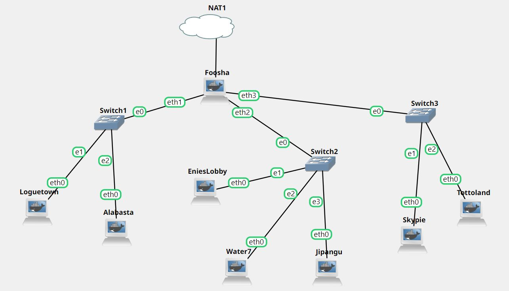
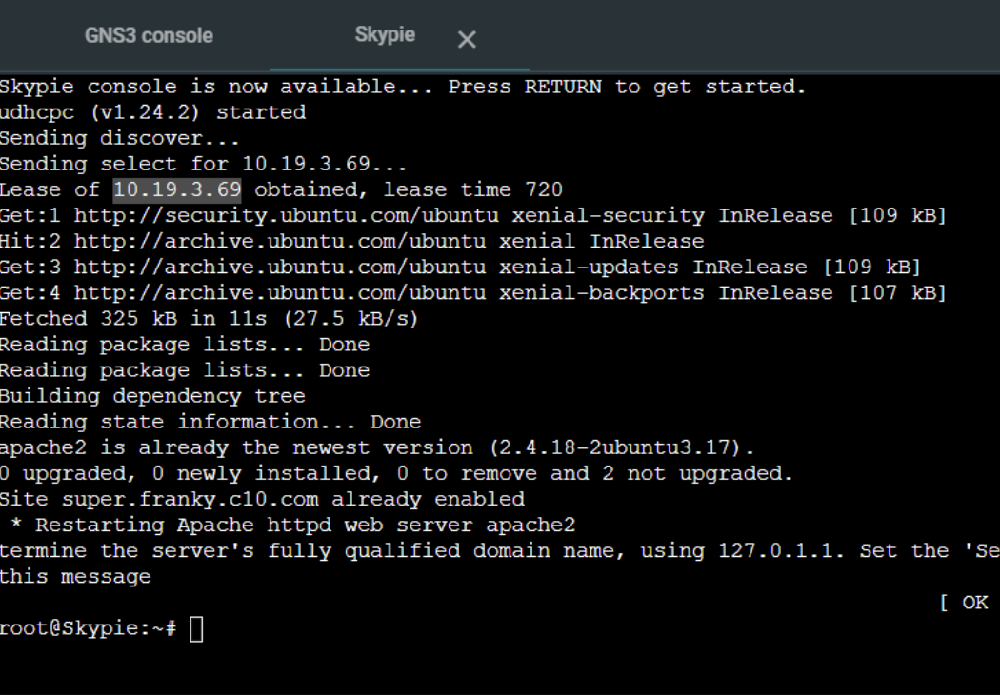
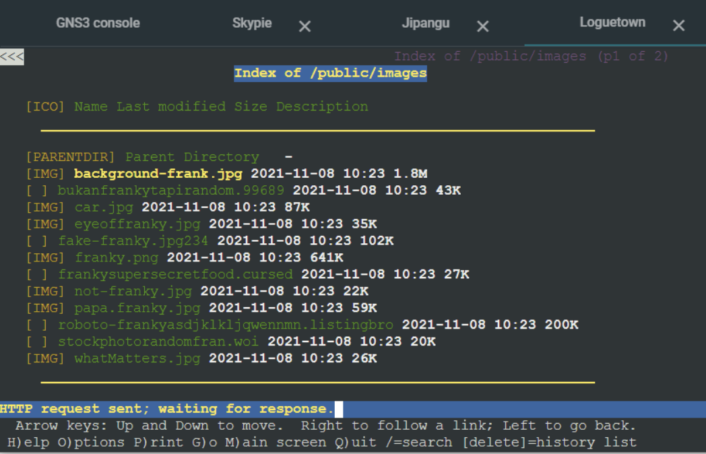
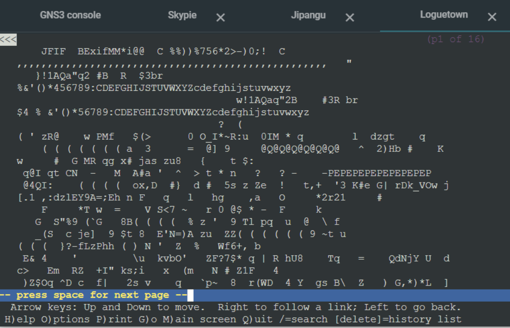

# Jarkom-Modul-3-C10-2021

## Anggota Kelompok C10
| Nama | NRP |
| ------------- | ------------- |
| Christian Bennett Robin | 05111940000078  |
| Erza Janitradevi Nadine  | 05111940000153  |
| Akmal Zaki Asmara  | 05111940000154  |

## Soal dan Pembahasan
### No 1
Soal: Luffy bersama Zoro berencana membuat peta tersebut dengan kriteria EniesLobby sebagai DNS Server, Jipangu sebagai DHCP Server, Water7 sebagai Proxy Server.

Jawaban : Membuat topologi seperti perintah soal dan mencoba ping google.com pada EniesLobby,  Jipangu, dan Water7.
- Topologi
  
- ping google.com<br/>
  
  
  
  
### No 2
Soal: dan Foosha sebagai DHCP Relay

Jawaban : Untuk menjadikan Foosha sebagai DHCP Relay, perlu dilakukan konfigurasi pada Jipangu sebagai DHCP Server dan pada Foosha. 
- Menambahkan konfigurasi pada `isc-dhcp-server` pada Jipangu
  Mengarahkan interfaces pada `eth0` karena Jipangu tersambung dengan nodes lainnya melalui eth0 sehingga Jipangu dapat tersambung dengan Foosha.
  

- Menambahkan konfigurasi pada `dhcpf.conf` pada Jipangu
  <br/>Pada Jipangu dilakukan konfigurasi untuk melakukan relay pada subnet yang menghubungkan Jipangu dengan Foosha, yaitu subnet 10.19.2.0.
  ```
    subnet 10.19.2.0 netmask 255.255.255.0{
     }
  ```
  
- Menambahkan konfigurasi pada `isc-dhcp-relay` pada Foosha
  <br/>Menambahkan IP Address Jipangu pada `SERVERS` sehingga Foosha dapat menerima dan melanjutkan request kepada DHCP Server. Kemudian, pada `INTERFACES` ditambahkan `eth0 eth1 eth2` supaya Foosha dapat berjalan dan menerima request dari switch 1, 2, dan 3.
   
   
### Konfigurasi 'dhcpd.conf' pada Jipangu
Konfigurasi pada `/etc/dhcp/dhcpd.conf` dibawah ini akan digunakan untuk nomor 3-6


### No 3
Soal: Semua client yang ada HARUS menggunakan konfigurasi IP dari DHCP Server. Client yang melalui Switch1 mendapatkan range IP dari [prefix IP].1.20 - [prefix IP].1.99 dan [prefix IP].1.150 - [prefix IP].1.169

Jawaban : 
- Supaya semua client mendapatkan IP dari DHCP Server, pada konfigurasi `/etc/network/interfaces` ditambahkan 
  ```
    auto eth0
    iface eth0 inet dhcp
  ```
  dan comment `echo nameserver 192.169.122.1 > /etc/resolv.conf` pada masing-masing client sehingga nameserver mengarah pada DHCP Server.
  
- Konfigurasi pada `/etc/dhcp/dhcpd.conf` untuk set range IP pada switch 1 
  <br/>Konfigurasi untuk switch 1 menggunakan subnet `10.19.1.0 ` seperti pada gambar di atas dengan range ip sebagai berikut. Angka 1 pada IP menunjukkan bahwa IP ini digunakan untuk switch 1 yang terhubung dengan `eth1`.
  ```
  subnet 10.19.1.0 netmask 255.255.255.0{
    ...
    range 10.19.1.20 10.19.1.99;
    range 10.19.1.150 10.19.1.169;
    ...
   }
  ```
- Berikut ini adalah Client Loguetown dan Alabasta yang memiliki IP dari DHCP Server
  
  
  
### No 4
Soal: Client yang melalui Switch3 mendapatkan range IP dari [prefix IP].3.30 - [prefix IP].3.50 
Jawaban : 
- Konfigurasi pada `/etc/dhcp/dhcpd.conf` untuk set range IP pada switch 3 
  <br/>Konfigurasi untuk switch 3 menggunakan subnet `10.19.3.0 ` seperti pada gambar di atas dengan range ip sebagai berikut. Angka 3 pada IP menunjukkan bahwa IP ini digunakan untuk switch 3 yang terhubung dengan `eth3`.
  ```
  subnet 10.19.3.0 netmask 255.255.255.0{
    range 10.19.3.30 10.19.3.50;
    ...
   }
  ```

- Berikut ini adalah Client Skypie dan Tottoland yang memiliki IP dari DHCP Server. Skypie memiliki ip `10.19.3.69` karena diberikan fixed address yang konfigurasinya akan dijelaskan pada nomor 7.
  
  
  
### No 5
Soal: Client mendapatkan DNS dari EniesLobby dan client dapat terhubung dengan internet melalui DNS tersebut.
Jawaban:
- Menggunakan DNS Forwarder pada EniesLobby sebagai DNS Server supaya client dapat terhubung ke internet dengan menambahkan konfigurasi sebagai berikut pada `/etc/bind/named.conf.options`
  ```
  ...
  forwarders {
    192.168.122.1;
  };
  ...
  ```
  dan comment `dnssec-validation auto;` serta menambahkan`allow-query{any;};`
- Pada client akan terlihat bahwa nameserver mengarah pada IP Enieslobby yaitu `10.19.2.2` ketika mengecek `/etc/resolv.conf` seperti pada gambar    berikut (tambain gambar)

### No 6
Soal: Lama waktu DHCP server meminjamkan alamat IP kepada Client yang melalui Switch1 selama 6 menit sedangkan pada client yang melalui Switch3 selama 12 menit. Dengan waktu maksimal yang dialokasikan untuk peminjaman alamat IP selama 120 menit.
Jawaban:
- Menambahkan konfigurasi `dhdcp.conf` untuk switch 1 dan switch 3 sebagai berikut. 
  ```
    subnet 10.19.1.0 netmask 255.255.255.0{
      ...
      default-lease-time 360;
      max-lease-time 7200;
      ...
     }
  ```
   ```
    subnet 10.19.3.0 netmask 255.255.255.0{
      ...
      default-lease-time 720;
      max-lease-time 7200;
      ...
    }
  ```
  Default lease time untuk switch 1 adalah 360 detik dan switch 3 adalah 720 detik, sedangkan max lease time switch 1 dan 3 bernilai sama yaitu 7200.
  
### No 7
Soal:
Luffy dan Zoro berencana menjadikan Skypie sebagai server untuk jual beli kapal yang dimilikinya dengan alamat IP yang tetap dengan IP [prefix IP].3.69 (7). 

Jawab:
Edit konfigurasi /etc/dhcp/dhcpd.conf di Jipangu, lalu tambahkan baris berikut:

```
...
host Skypie {
    hardware ethernet 3e:a0:f8:fb:39:c5;
    fixed-address 10.19.3.69;
}
```

Setelah itu edit konfigurasi /etc/network/interfaces di Client, seperti misalnya di Loguetown dan tambahkan baris berikut:

```
...
hwaddress ether 3e:a0:f8:fb:39:c5
```

Saat menyalakan node Skypie, didapatkan IPnya tetap, yaitu 10.19.3.69


### No 8

### No 9

### No 10

### No 11

### No 12 & 13
Soal: 
Saatnya berlayar! Luffy dan Zoro akhirnya memutuskan untuk berlayar untuk mencari harta karun di super.franky.yyy.com. Tugas pencarian dibagi menjadi dua misi, Luffy bertugas untuk mendapatkan gambar (.png, .jpg), sedangkan Zoro mendapatkan sisanya. Karena Luffy orangnya sangat teliti untuk mencari harta karun, ketika ia berhasil mendapatkan gambar, ia mendapatkan gambar dan melihatnya dengan kecepatan 10 kbps (12). Sedangkan, Zoro yang sangat bersemangat untuk mencari harta karun, sehingga kecepatan kapal Zoro tidak dibatasi ketika sudah mendapatkan harta yang diinginkannya (13).

Jawaban:
Edit konfigurasi /etc/squid/squid.conf di Water7 dan tambahkan baris berikut: 

```
...
acl USERS proxy_auth REQUIRED
acl USER1 proxy_auth luffybelikapalc10
acl USER2 proxy_auth zorobelikapalc10
acl BLACKLIST dstdomain .google.com
acl ext_block url_regex "/etc/squid/ext_block.txt"

delay_pools 2
delay_class 1 1
delay_access 1 allow USER2
delay_parameters 1 -1/-1
delay_class 2 1
delay_access 2 allow ext_block
delay_parameters 2 1250/1250
...

```

Pool dibagi menjadi 2 class untuk 2 konfigurasi. Class pertama dikonfigurasi untuk USER2 yaitu zorobelikapalc10. Agar bandwidthnya tidak dilimit seperti permintaan soal 13, maka delay_parameter pool 1 diatur agar menjadi -1/-1. Sedangkan class kedua dikonfigurasi agar bandwidthnya dilimit menjadi 10 kbps atau 1250 Bps seperti permintaan soal 12. Class kedua juga dikonfigurasi agar berlaku pada file yang extensionnya terdapat di dalam file /etc/squid/ext_block.txt yang berisi:

```
\.jpg$
\.png$
```

Saat login menggunakan luffybelikapalc10, maka user tersebut akan terlimit bandwidth download file .jpg dan .png nya seperti pada konfigurasi. Saat berusaha untuk mendownload file tersebut, user tersebut akan tertahan pada page ini karena sudah di limit bandwidthnya.


Sedangkan jika login menggunakan zorobelikapalc10, saat user berusaha untuk mendownload file yang bukan .jpg atau .png, download tersebut akan langsung selesai dan pindah ke page selanjutnya karena tidak di limit bandwidthnya.

